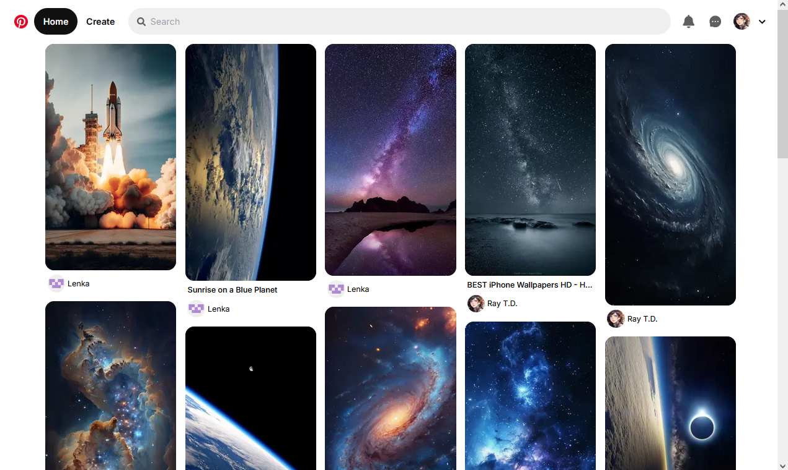
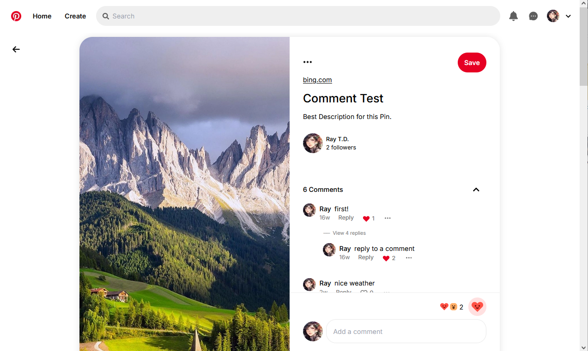
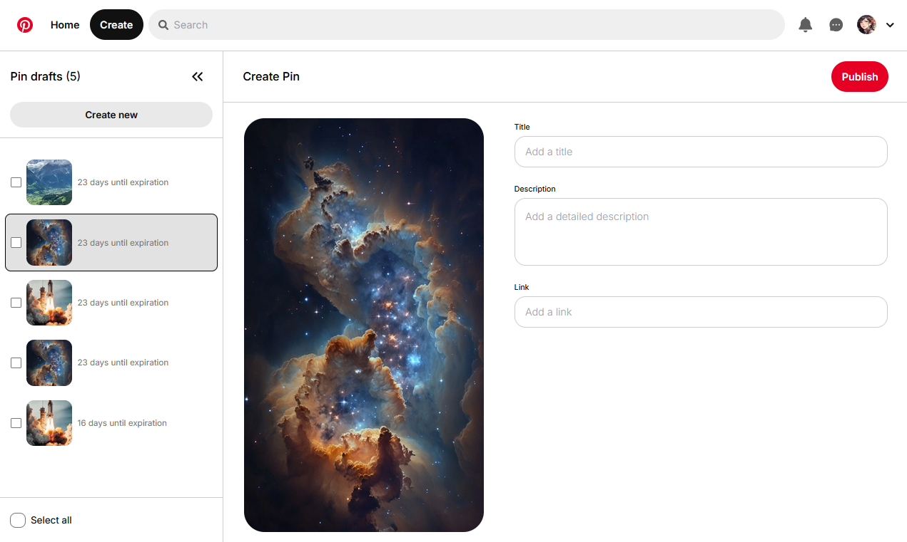
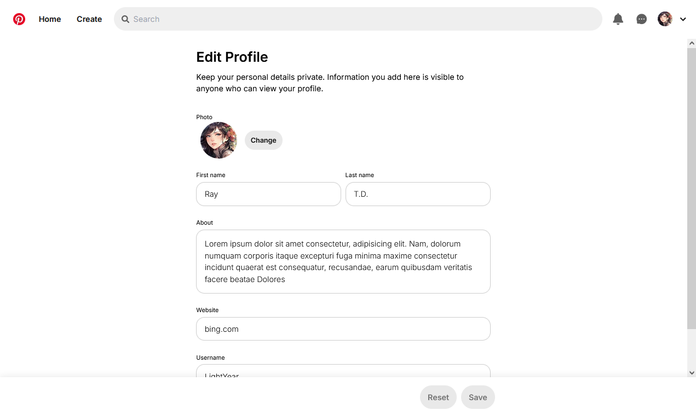

# Pinterest Clone

A simplified [Pinterest](https://www.pinterest.com/) clone built with Next.js, MongoDB and GraphQL.

Explore the [live application](https://pinterest-eosin-six.vercel.app/)

## Features

- **Authentication:** Sign up and sign in using Google, GitHub
- **User:**
  - **Profile Management:** Edit profile information or change the avatar
  - **Follow and Unfollow**
- **Pin:**
  - **Feed:** Infinite scrolling
  - **Create:** Create pin drafts with an image, title and description. Manage drafts and publish them
  - **Edit and Delete**
  - **Save and Unsave**
- **Search:** Search for pins by title
- **Comment:**
  - **Create:** Add comments to pins or reply to comments
  - **Edit and Delete**
  - **Like and Unlike**
- **Responsive Layout**

## Built With

- [Next.js](https://nextjs.org/)
- [Redux](https://redux.js.org/)
- [Mongoose](https://www.mongodb.com/) - Database operation
- [Apollo GraphQL](https://www.apollographql.com/) - GraphQL server and client
- [Tailwind CSS](https://tailwindcss.com/) - CSS framework
- [Storybook](https://storybook.js.org/) - UI component development
- [Clerk](https://clerk.dev/) - Authentication
- [React-Hook-Form](https://react-hook-form.com/) - Form handling

## Screenshots

<div style="display: flex; flex-wrap: wrap; gap: 10px">
  
  
  
  
</div>

## Prerequisites

- Node.js ^20.0.0

## How to use

To install dependencies:

```sh
npm install
```

To start the development server:

```sh
npm run dev
```

Please note that secrets are not included. If you want to run the app locally, you need to create a `.env.local` file and add secrets as follows:

```sh
# uploadthing
UPLOADTHING_SECRET=
UPLOADTHING_APP_ID=
# clerk
NEXT_PUBLIC_CLERK_PUBLISHABLE_KEY=
CLERK_SECRET_KEY=
# mongodb
MONGODB_URI=
```
